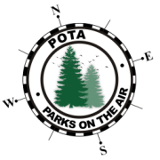

# Winlink_Form-xOTA
   
### Unofficial Off-Grid Spotting & Hunting Parks, Summits, and more, OTA via Winlink

This Winlink form supports activating and hunting Parks on the Air (**[POTA](https://pota.app/#/)**), Silos on the Air (**[SiOTA](https://www.silosontheair.com/)**), Summits on the Air (**[SOTA](https://sotawatch.sota.org.uk/en/)**), and World Wide Flora & Fauna (**[WWFF](https://wwff.co/dx-cluster/)**) off-grid.

This form makes use of [Rich/W4PI](https://www.qrz.com/db/W4PI)'s [POTAGW](https://www.qrz.com/db/W4PI)@outlook.com gateway for POTA, and [Josh/VK2MES](https://www.zindello.com.au)'s [APSPOT](https://apspot.radio/getting-started/)@apspot.radio gateway for POTA, SiOTA, SOTA and WWFF, to spot yourself and view park/summit active spots.

Simply unzip and place the TXT and HTML files in **RMS Express > Global Folders > Templates folder**. If you have other existing forms in this folder, you can create a sub-folder to group/organize these files in its own group when you access it from composing a new Winlink message (e.g. Off-Grid Parks & Summits Activity). From compose new message window, click **Select Template > Global Templates** and double-click the form you just placed in the Templates folder.
